# 🍔 QuickBite - Premium Food Ordering & Geofenced Delivery System
*(Comprehensive Technical Documentation & Presentation Outline)*

This document is structured to serve as both a comprehensive project documentation and a **ready-to-use outline for your PowerPoint (PPT) presentation**. It covers every workflow, feature, architecture detail, authentication strategy, role implementation, and the complete technical journey of how the platform was built.

---

## 📌 Slide 1: Introduction & Executive Summary
**QuickBite** is a modern, real-time, multi-vendor food discovery, ordering, and geofenced delivery platform. 
It orchestrates seamless communication between **Customers, Vendors (Restaurants), Delivery Agents, and Admins** using real-time WebSockets and responsive interfaces.

**Key Highlights:**
* **Real-time Synchronization:** Powered by Socket.io for live tracking and dispatch.
* **Geofenced Delivery Engine:** Haversine formula-based tracking with automatic OTP generation within a 100m radius.
* **Multi-Vendor Ecosystem:** 18 diverse regional restaurants spanning across Dimapur and Chumoukedima.
* **Automated Finances:** Stripe API integrations with dynamic driver payouts (₹5/km calculated via live coordinates).

---

## 📌 Slide 2: The Core Tech Stack (MERN + WebSockets)
We selected the MERN stack coupled with real-time event listeners to provide a highly scalable, non-blocking architecture.

* **Frontend:** React.js, Context API (Auth, Cart, Filter), CSS/Tailwind, Framer Motion (for animations).
* **Backend:** Node.js, Express.js (Asynchronous, event-driven).
* **Database:** MongoDB Atlas with Mongoose ORM (NoSQL allows flexible menu schema scaling).
* **Real-Time Communication:** Socket.io (Bi-directional WebSockets for GPS and Order State).
* **Payment Gateway:** Stripe API (Standardized to INR ₹ for secure checkout).
* **Mapping & Tracking:** Leaflet maps for live GPS plotting.

---

## 📌 Slide 3: Backend Services & RESTful Routes
Our backend is structured into modular micro-services to separate business logic and ensure scalability:

* **User Service (`/api/user`):**
  * `POST /register`: Hashes passwords using bcrypt, generates JWT, establishes user profile.
  * `POST /login`: Validates credentials, issues secure role-based JWT.
* **Food & Menu Service (`/api/food`):**
  * `GET /list`: Fetches all active food items.
  * `POST /add`: Parses multi-part form data via **Multer**, stores image locally in `/uploads`, and saves food metadata in DB.
* **Order Service (`/api/order`):**
  * `POST /place`: Integrates with Stripe, returns checkout session URL.
  * `POST /verify-delivery-otp`: Validates the driver-submitted OTP against the DB.
* **Delivery Service (`/api/delivery`):**
  * `GET /orders`: Proximity search for available gigs based on Driver GPS.
  * `POST /accept`: Locks the gig to a specific driver.
* **Restaurant Service (`/api/restaurant`):**
  * `POST /update`: Allows vendors to toggle food availability or update menus.

---

## 📌 Slide 4: Database Tech Stack & Mongoose Schemas
We chose MongoDB because its document-oriented structure perfectly handles dynamic menus and hierarchical user roles.

* **Users (`userModel.js`):** Unified schema for customers, vendors, drivers, and admins. Stores arrays of addresses and GeoJSON location data.
* **Restaurants (`restaurantModel.js`):** Stores details, ratings, coordinates (`[longitude, latitude]`), and cuisine types.
* **Orders (`orderModel.js`):** The central entity. Tracks embedded item arrays, Stripe payment status, geofenced proximity states, and secure verification OTPs.
* **Delivery Agents (`deliveryAgentModel.js`):** Tracks active assignments, vehicle details, current GPS coordinates, total deliveries, and accumulated earnings.

---

## 📌 Slide 5: Authentication & Security Logic (RBAC)
Authentication is handled via **JSON Web Tokens (JWT)** and **Bcrypt** password hashing. A single unified Auth Middleware verifies the token and dynamically resolves the user's role.

**Business Logic:**
1. User logs in. Server signs a JWT payload `({ id: user._id, role: user.role })`.
2. Token is stored in `localStorage` on the frontend.
3. Every API request passes the token in the `headers`.
4. Middleware decodes the token, validates expiration, and injects `userId` into the request body.

---

## 📌 Slide 6: Business Logic: The Persistent Cart
Customers browse the platform, add items to a persistent cart, and initiate Stripe checkouts. 

**Business Logic:**
* **State Management:** React Context API handles local state (`cartItems`) instantly for zero-latency UI updates.
* **Database Sync:** Behind the scenes, `addToCart` triggers a `POST` request to sync the local state with the user's MongoDB document. If the user switches devices, their cart remains perfectly intact.
* **Checkout Generation:** Stripe session logic loops through the DB-verified cart items to prevent client-side price manipulation.

---

## 📌 Slide 7: Business Logic: Vendor Order Management
Vendors have a dashboard to manage their specific restaurant. The system maps the logged-in Vendor ID to their specific Restaurant Document.

**Business Logic:**
1. Vendor receives WebSocket broadcast: `new_order`.
2. Vendor prepares food and clicks "Out for Delivery".
3. **Controller Trigger:** The backend updates the DB status and immediately emits a `new_delivery_gig` Socket event to all online drivers whose GPS coordinates are within a predefined geographical radius of the restaurant.

---

## 📌 Slide 8: Business Logic: The Geofenced Delivery Engine
*(The Proximity-Based GPS Tracking Loop)*

This is the crown jewel of QuickBite.
1. **Haversine Distance Tracking:** The driver's app continuously pulls coordinates via `navigator.geolocation.watchPosition()`. It uses the Haversine formula to calculate the exact spherical distance between the Driver and the Customer.
2. **Dynamic Payout Calculation:** Distance is multiplied by a base rate of **₹5 per km** (with a minimum payout threshold) to calculate the exact driver earnings dynamically.
3. **The 100m Geofence Trigger:** The backend continuously monitors the distance. Once distance `<= 100 metres`, the backend securely generates a 6-digit delivery OTP.
4. **Secure Handshake:** Customer receives the OTP. Driver inputs the OTP on their dashboard. The system verifies it, marks the order "Delivered", automatically credits the dynamic `₹` earnings to the driver's wallet, and resets their status to "Online".

---

## 📌 Slide 9: System Architecture Diagram
*(Use this logic for your PPT flowcharts)*

```mermaid
sequenceDiagram
    autonumber
    actor Customer as 👤 Customer
    actor Restaurant as 🍳 Restaurant (Vendor)
    actor Driver as 🛵 Delivery Agent
    participant Backend as ⚙️ Backend (WebSockets)

    Customer->>Backend: Place Order & Pay (Stripe)
    Backend->>Restaurant: Broadcast new order
    Restaurant->>Backend: Mark "Out for Delivery"
    Backend->>Driver: Broadcast gig to nearby drivers
    Driver->>Backend: Accept Gig
    
    rect rgb(30, 41, 59)
        Note over Driver, Customer: Real-Time GPS Tracking Loop
        Driver->>Backend: Active Location Broadcast
        Backend->>Customer: Sync map marker
        Backend->>Backend: Proximity check (<= 100m)
    end

    Backend->>Customer: Generate & Send secure 6-digit OTP
    Customer->>Driver: Hand over OTP code
    Driver->>Backend: Submit OTP for Verification
    Backend->>Driver: Confirm Delivery & Add Dynamic Earnings (₹)
```

---

## 📌 Slide 10: The Multi-Cuisine Ecosystem
The database is successfully seeded with 18 authentic regional and fast-food restaurants spanning across **Dimapur** and **Chumoukedima**. The items are strictly categorized and paired with high-quality UI asset imagery:
* **Naga Cuisine:** *Naga Kitchen* (Axone Chicken, Bamboo Shoot Chicken)
* **Bihari & Rajasthani:** *Bihari Zaika*, *Royal Rajasthani* (Litti Chokha, Dal Bati)
* **Maharashtrian & Bengali:** *Sonar Bangla* (Machher Jhol)
* **Salads (Pure Veg):** *The Veg Salad Bowl* (Exclusively Veg Salad)
* **Sandwiches:** *Sandwich Haven*, *Subway Bites* (Vegan, Grilled, Chicken)
* **Cakes & Waffles:** *Cake Walk*, *Sweet Tooth Bakery*, *Morning Delight* (Cupcakes, Vegan Cakes, Waffles)
* **Burgers (No Beef):** *Dimapur Burgers* (Strictly Chicken & Veg Burgers only)
* **Fried Chicken:** *Cluck Cluck*, *Crunchy Bird* (Crispy Fried Chicken, Spicy Wings, Popcorn)
* **Fresh Fruits:** *Fresh Picks* (Fresh Fruit Bowls)
* **Pizza & Biryani:** *Pizza Paradise*, *Hyderabadi House* (Margherita, Chicken BBQ, Veg/Chicken Biryani)
* **Sushi & Healthy Bowls:** *Tokyo Bites*, *Fit Foods* (Veg/Chicken Sushi, Quinoa, Chicken Salad Bowl)

*Note: All users, vendors, and drivers share a universal testing password: `12345678`. The database is strictly vetted to exclude any Pork, Beef, or Steak items.*

---

## 📌 Slide 11: How We Created It (Development Journey)
* **Phase 1 (Foundation):** Designed the UI/UX using React and Tailwind/CSS Modules. Focused on responsive layouts and the central StoreContext.
* **Phase 2 (Backend & DB):** Spun up the Express server and MongoDB clusters. Built out the JWT Auth middleware and bcrypt hashing.
* **Phase 3 (Role Management):** Segregated the dashboard into 4 portals: Admin, Vendor, Customer, and Driver. Created unique API boundaries for each.
* **Phase 4 (Sockets & Maps):** Integrated `Socket.io` and `Leaflet`. Built the simulated location tracking script for easy demonstration without needing physical movement.
* **Phase 5 (Refinement):** Seeded the system with customized Dimapur/Chumoukedima local data, added the dynamic Haversine pricing engine (₹5/km), and strictly enforced the menu categories.

---

## 📌 Slide 12: Setup & Execution Guide
*(For Demo Purposes)*

**1. Environment:**
Requires Node.js v18+, MongoDB Atlas, and Stripe API Keys.

**2. Startup Commands:**
* **Backend:** `cd Backend && npm install && npm run server`
* **Frontend:** `cd Frontend && npm install && npm run dev`
* **Admin:** `cd admin && npm install && npm run dev`

**3. Running the Simulation:**
To easily demonstrate the app without driving around:
1. Driver accepts order.
2. Click **Go to Restaurant**.
3. Click **Deliver Food** step-by-step. The GPS distance indicator will decrement sequentially.
4. At `< 100m`, the OTP triggers automatically!

---
*Crafted for the QuickBite Presentation Deck.*
