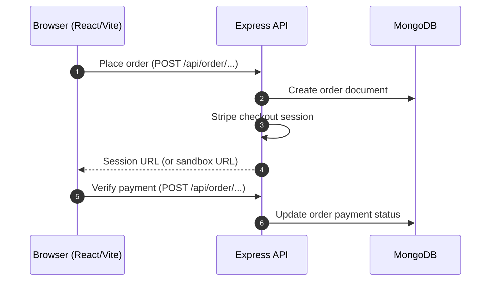
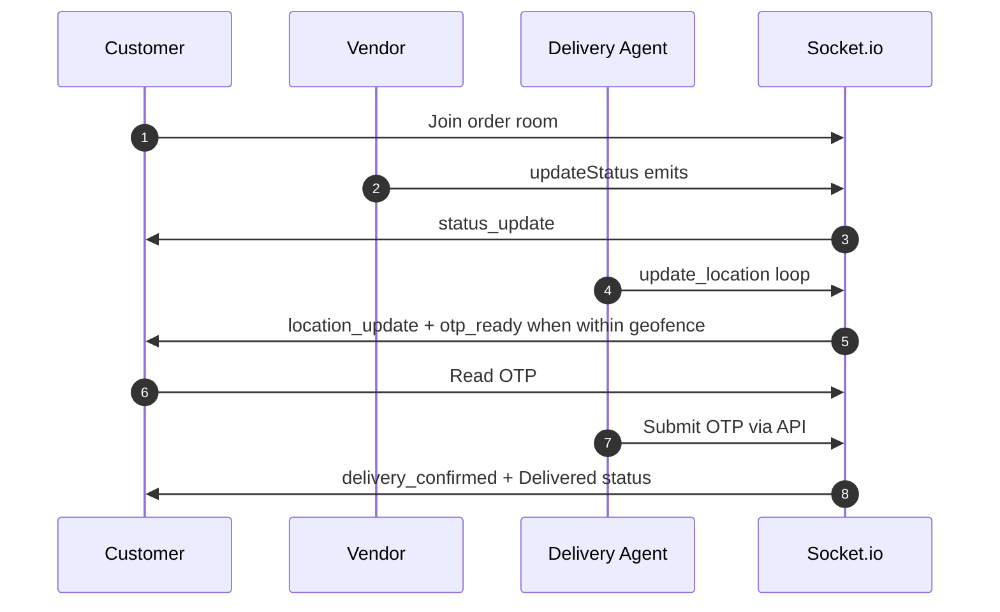
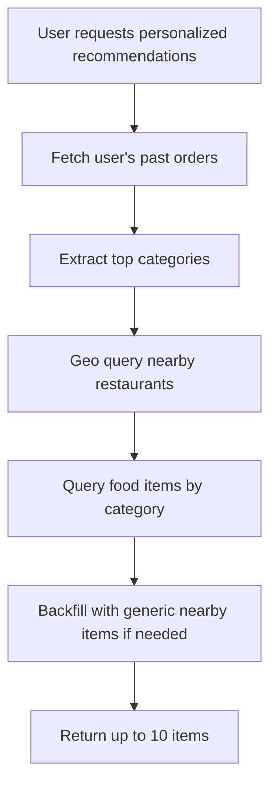
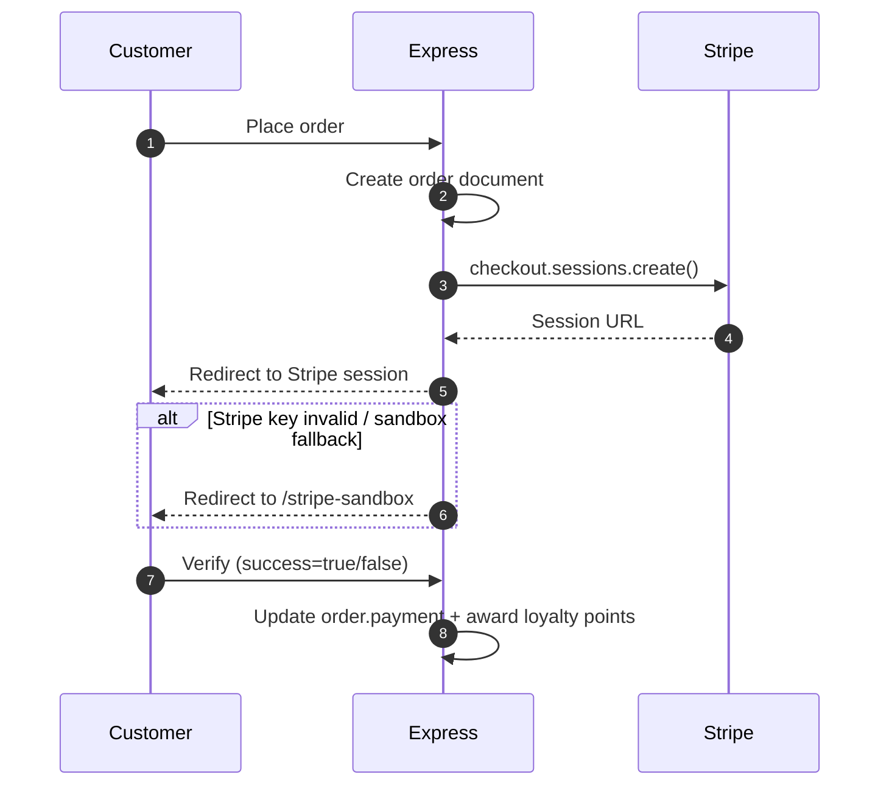

# QuickBite — Full-Stack Food Delivery (Multi-Vendor + Real-Time OTP)

## Team

**Ayush · Khairaj · Vidhut**

## Stack

- **Frontend:** React + Vite
- **Backend:** Node.js + Express
- **Database:** MongoDB (Mongoose)
- **Real-time:** Socket.io
- **Payments:** Stripe (with sandbox fallback)
- **Auth:** JWT (access + refresh token rotation in UI)

---

## 1) System Overview

QuickBite is a multi-portal food delivery platform:

```mermaid
flowchart LR
  A[Customer Browser + Order + Pay] -->|HTTP (REST) / WebSockets| B[Express API Server]
  C[Vendor (Restaurant Owner)] -->|HTTP + DB updates| B
  D[Delivery Agent] -->|HTTP (accept/complete) + WebSockets| B
  E[(MongoDB)] <-->|Models| B
  B -->|Socket.io events| A
  B -->|Socket.io events| D
```

### Main Portal Roles

- **Customer:** Browse → cart → checkout (Stripe) → live tracking → OTP delivery confirmation → chat
- **Vendor (restaurant_owner):** Manages menu and order status updates
- **Delivery Agent (delivery):** Accepts orders → navigates → enters OTP within the geofence

---

## 2) Architecture (Request + Event Flow)

### REST APIs (HTTP)



### Real-Time Updates (Socket.io)



---

## 3) Key Domain Models (Mongoose Schemas)

> **Note:** These are the core schema concepts used across the system.

### User (`userModel.js`)

```js
{
  name: String,
  email: String,
  password: String,                 // bcrypt hash
  role: 'customer'|'admin'|'restaurant_owner'|'delivery',

  cartData: Object,                // server-side cart backup
  addresses: [{
    label, street, city, state, zipCode, country
  }],

  currentLocation: {
    type: 'Point',
    coordinates: [lng, lat]
  },

  favorites: [foodId],

  activeToken: String|null,
  refreshToken: String|null,
  tokenVersion: Number,

  vehicleDetails: String,         // for delivery agents
  licensePlate: String,
  phone: String,
  profilePic: String,

  loyaltyPoints: Number,
  isAvailable: Boolean,
  totalDeliveries: Number
}
```

### Restaurant (`restaurantModel.js`)

```js
{
  name: String,
  description: String,
  ownerId: ObjectId -> user,

  address: { street, city, state, zipCode, country },
  location: {
    type: 'Point',
    coordinates: [lng, lat]
  },

  rating: Number,
  cuisineTypes: [String],
  bannerImage: String,
  images: [String],
  isActive: Boolean
}
```

### Food (`foodModel.js`)

```js
{
  name: String,
  description: String,
  price: Number,

  image: String,
  images: [String],

  category: String,
  restaurantId: ObjectId -> restaurant,

  dietaryTags: [String],
  isAvailable: Boolean
}
```

### Order (`orderModel.js`)

```js
{
  userId: String,
  items: [
    {
      // snapshot of cart item data
    }
  ],

  amount: Number,
  address: Object,

  status: String,                 // e.g., "Food is Getting Ready!", "Out for delivery", "Delivered"
  date: Date,

  payment: Boolean,

  restaurantId: ObjectId -> restaurant,
  deliveryAgentId: ObjectId -> user,

  deliveryOTP: String|null,      // 6-digit OTP
  otpVerified: Boolean,
  otpGeneratedAt: Date|null
}
```

### Delivery Agent (`deliveryAgentModel.js`)

```js
{
  userId: ObjectId -> user,

  vehicleDetails: String,
  currentLocation: {
    type: 'Point',
    coordinates: [lng, lat]
  },

  isAvailable: Boolean,
  activeOrderId: ObjectId -> order|null,

  totalDeliveries: Number,
  earnings: Number
}
```

### Coupon (`couponModel.js`)

```js
{
  code: String,                   // uppercase
  discountPercentage: Number,
  maxDiscountAmount: Number,
  minOrderValue: Number,

  restaurantId: ObjectId|null,
  usedBy: [userId],              // single-use per user

  expiryDate: Date,
  isActive: Boolean
}
```

### Review (`reviewModel.js`)

```js
{
  userId: ObjectId -> user,
  restaurantId: ObjectId,
  foodId: ObjectId|null,
  orderId: ObjectId,

  rating: Number,               // 1..5
  comment: String,
  timestamps: true
}
```

### Chat (`chatModel.js`)

```js
{
  orderId: ObjectId,
  senderId: ObjectId,
  senderName: String,
  role: 'customer'|'delivery',

  text: String,                 // capped length
  timestamps: true
}
```

### Notification (`notificationModel.js`)

```js
{
  userId: ObjectId,
  type: 'order'|'promo'|'system',

  title: String,
  message: String,

  orderId: ObjectId|null,
  isRead: Boolean,
  timestamps: true
}
```

---

## 4) Geofenced Delivery + OTP Confirmation

Delivery confirmation is controlled through a **distance check** between the delivery agent and the customer.

### Geofence Logic (Concept)

```mermaid
graph TD
  A[Agent sends update_location (lat,lng)] --> B[Server computes distance to customer]
  B --> C{distance <= 100m?}
  C -- yes --> D[Generate OTP (if not already generated)]
  D --> E[Emit otp_ready to customer]
  C -- no --> F[Continue tracking]
  E --> G[Agent submits OTP via API]
  G --> H[Server verifies OTP + expiry]
  H --> I[Mark order as Delivered + emit delivery_confirmed]
```

### OTP Expiry

- The OTP becomes invalid after the configured expiry window (10 minutes).

---

## 5) Socket Rooms Pattern

Each order has a dedicated room:

- Room: `order_{orderId}`
- The customer and delivery agent join the room for that specific order.

```mermaid
flowchart LR
  X[Customer UI] --> R[Socket Room: order_{orderId}]
  Y[Vendor updates via REST] --> Z[Server emits status_update]
  Z --> R
  W[Delivery agent UI] --> R
```

---

## 6) Recommendations (Personalized + Nearby)

The recommendation engine combines:

- User order history (category counts)
- Restaurant proximity (MongoDB `$near` using a geospatial index)



---

## 7) Payment Flow (Stripe + Fallback)



---

## 8) Demo Checklist (Quick Walkthrough)

1. Start the **Backend**
2. Start the **Frontend**
3. Register/Login as a **Customer**
4. Place an order (Stripe session / sandbox)
5. Vendor updates the order status
6. Delivery agent accepts the order
7. Agent approaches the customer → OTP emitted
8. Delivery agent submits OTP → Delivery confirmed + earnings updated
9. Customer sees real-time tracking + notifications

---

## 9) Setup Notes

- Configure `.env` for:
  - `MONGODB_URI`
  - `JWT_SECRET`
  - `STRIPE_SECRET_KEY` (and optionally webhook URLs depending on your setup)
- Start the Backend first, then the Frontend.

---

## Project Summary

QuickBite delivers a full-stack experience with:

- Multi-vendor food platform
- Real-time order tracking
- Geofenced OTP delivery confirmation
- Stripe payments (with sandbox fallback)
- Role-based portals (customer/vendor/delivery)
- Loyalty points + notifications
- Chat support per order

